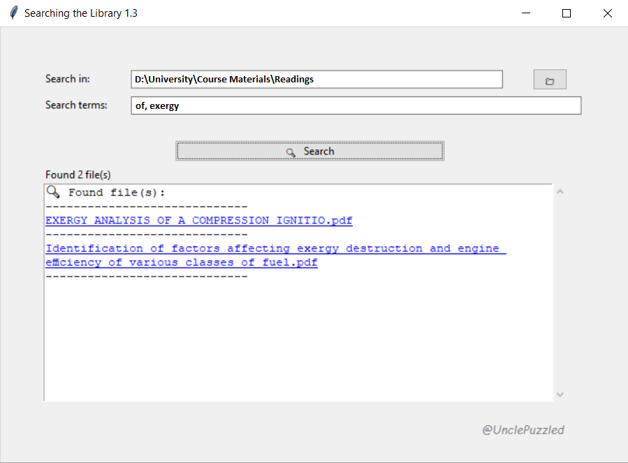

# 🔎 Searching-the-library

**Searching-the-library** is a lightweight Windows `.exe` utility designed to locate PDF and DJVU files within a specified folder. The program provides an immediate and minimal interface, requiring no installation or configuration. Its operation is based on matching file names to user-defined search terms.

---

## Features

- Input field for specifying the directory in which to search (`Search in`)
  - As of version **v1.3**, includes a quick-access folder selection button
- Input field for entering search terms (`Search terms`)
  - Terms can include words, phrases, or individual characters
  - Use commas to separate multiple terms
  - All terms must be present in the file name for a match to be registered
- Search is executed instantly, regardless of folder size
- Search results are shown in a dedicated results window
  - **v1.0:** Full file paths and names are listed in plain text
  - **v1.3:** Instead of showing the full path, clicking on a result opens the file's containing folder in the system file manager
- A scrollbar has been added in **v1.3** for improved navigation in the results window

---

## Installation & Usage

1. Download the `.exe` file from the [Releases](https://github.com/UnclePuzzled/Searching-the-library/releases) section
2. Run the file directly (no installation required)
3. Enter the target directory and search terms
4. Results are displayed immediately; click on any result to open its folder

- No internet connection is required

---

## License

This project is licensed under the [MIT License](LICENSE).

---

