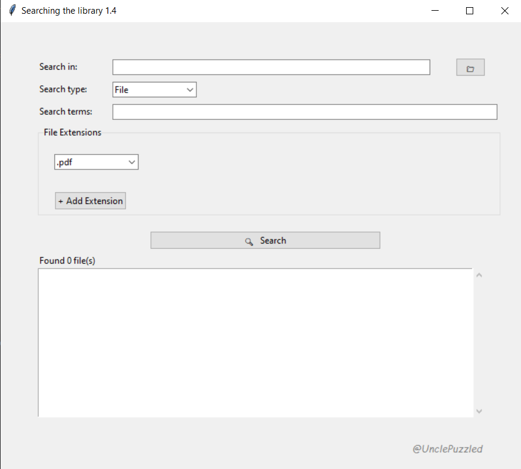

# 🔎 Searching-the-library

**Searching-the-library** is a lightweight Windows `.exe` utility designed to locate PDF and DJVU files within a specified folder. The program provides an immediate and minimal interface, requiring no installation or configuration. Its operation is based on matching file names to user-defined search terms.  

Current version — 1.4.0

---

The way you use the program is basically the same as in version 1.3, but a few things have been updated:
The focus on just PDF and DJVU files has been replaced — now you can search for multiple file types, as well as folders.

If you choose to search for folders, the program will look for folders whose names contain the keywords you enter in the "Search terms:" field, separated by commas. The search still happens in the directory you set in the "Search in:" field.

If you're searching for files (which is the default mode), you’ll see a dropdown menu to pick which file extension you want to search for.
You can select more than one extension — just hit the "+ Add Extension" button to add extra dropdowns. The search will then include all the selected extensions.

Once you hit the "Search" button, the results will appear in a new window.
Clicking on any result will open the folder where that item is located.

---
## Installation & Usage

1. Download the `.exe` file from the [Releases](https://github.com/UnclePuzzled/Searching-the-library/releases) section
2. Run the file directly (no installation required)
3. Enter the target directory and search terms
4. Results are displayed immediately; click on any result to open its folder

- No internet connection is required

---

## License

This project is licensed under the [MIT License](LICENSE).
